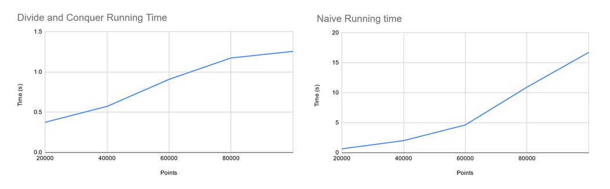

# ConvexHull
Computes the convex hull of a set of points. That is given the set of points, it returns the perimeter that would encompass all the points. Two algorithms to do this process are implemented in this repository (Divide and Conquer, Jarvis March). 

## Files
- convexhull.py: implementation of convexhull computation
- hullGUI.py: allows you to click in a window to add points, and then click a button to compute and draw the convex hull around those points.
  - Able to change between naive and divide and conquer algorithm

## Naive Approach
- The naive algorithm runs in O(nh) time with h being the number of points. It starts at the leftmost point and finds the point that is most counterclockwise from the current point. It adds it to the hull and repeats this until it arrives back at the starting node.
    - Initialize p as leftmost point
    - Do following while we do not come back to the first (or leftmost) point:
    - The next point q is the point such that the triplet (p, q, r) is counterclockwise for any other point r.
    - next[p] = q (Store q as next of p in the output convex hull).
    - p = q (Set p as q for next iteration).
- O(nh) with h being the number of points
- [Online Explaination](https://iq.opengenus.org/gift-wrap-jarvis-march-algorithm-convex-hull/)

## Analysis
The implemented algorithm runs in O(nlogn) time by using divide and conquer. It first sorts the list by their x-coordinate and splits it into list A and B. It continues to divide until the list contains at most three elements. This would take O(logn). At this point, the lower and upper tangent between A and B are computed in O(n) time. This is done by making sure two points are the tangent to both sets of points A and B. If they aren’t, increment them towards the respective upper and lower direction. It uses the points of the tangent and combines them into a singular set of points. The set of points consist of the upper tangent point of set B, clockwise to the lower tangent point of set B, then the to lower tangent point of set A, and finally clockwise to the upper tangent point of set A. This merge takes O(n) time and the resulting combined list of points is passed off to the previous call. Eventually a list is returned that represents the hull of the points.

The Divide and Conquer algorithm grows at a logarithmic rate while the naive algorithm grows exponentially
